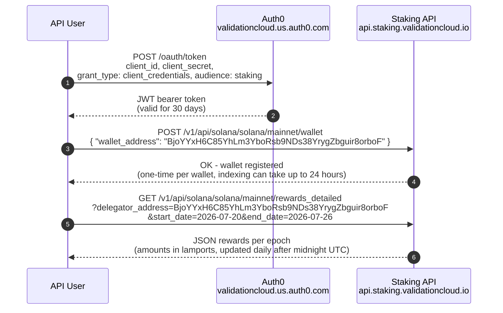

```mermaid
sequenceDiagram
    autonumber
    participant User as API User
    participant Auth as Auth0<br/>validationcloud.us.auth0.com
    participant API as Staking API<br/>api.staking.validationcloud.io

    User->>Auth: POST /oauth/token<br/>client_id, client_secret,<br/>grant_type: client_credentials, audience: staking
    Auth-->>User: JWT bearer token<br/>(valid for 30 days)

    User->>API: POST /v1/api/solana/solana/mainnet/wallet<br/>{ "wallet_address": "BjoYYxH6C85YhLm3YboRsb9NDs38YrygZbguir8orboF" }
    API-->>User: OK - wallet registered<br/>(one-time per wallet, indexing can take up to 24 hours)

    User->>API: GET /v1/api/solana/solana/mainnet/rewards_detailed<br/>?delegator_address=BjoYYxH6C85YhLm3YboRsb9NDs38YrygZbguir8orboF<br/>&start_date=2026-07-20&end_date=2026-07-26
    API-->>User: JSON rewards per epoch<br/>(amounts in lamports, updated daily after midnight UTC)

```
